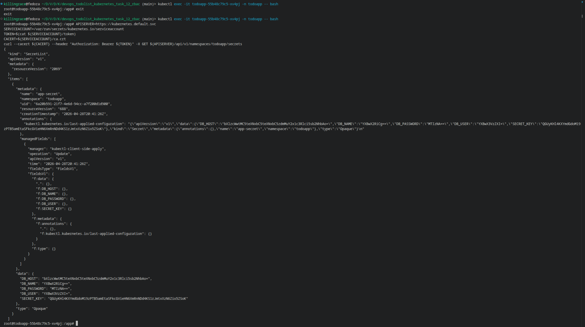

# Validate

- Create cluster

    ```sh
    kind create cluster --config cluster.yml
    ```

- Apply all manifests with

    ```sh
    ./bootstrap.sh
    ```

- get list of all pods

    ```sh
    kubectl get pods -n todoapp
    ```

- Enter into your pod

    ```sh
    kubectl exec -it <your_pod_name> -n todoapp -- bash
    ```

- paste in pod this command

    ```sh
    APISERVER=https://kubernetes.default.svc
    SERVICEACCOUNT=/var/run/secrets/kubernetes.io/serviceaccount
    TOKEN=$(cat ${SERVICEACCOUNT}/token)
    CACERT=${SERVICEACCOUNT}/ca.crt
    curl --cacert ${CACERT} --header "Authorization: Bearer ${TOKEN}" -X GET ${APISERVER}/api/v1/namespaces/todoapp/secrets
    ```

    if you see your secrets, all work correctly


